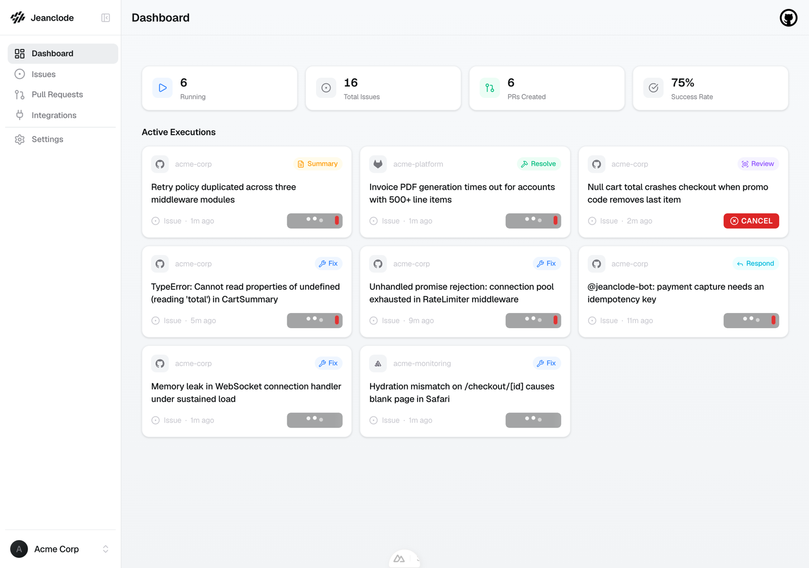

# jeanclode

Jeanclode is a self-hosted autonomous coding agent that runs on your own infrastructure. It listens to events from Sentry, GitHub, and GitLab, then runs purpose-built multi-agent workflows on the Claude Agent SDK to triage and fix issues — opening PRs automatically without human intervention.



## What it does

- **Sentry fix** — receives Sentry error webhooks, triages issues in parallel, groups related bugs by root cause, and opens fix PRs with code changes; a fix that spans several repos gets a PR in each, on one shared branch
- **Code review** — reviews GitHub PRs and GitLab MRs with a multi-agent pipeline (two independent analyzers, synthesizer, deduplicator, fact-checker, guardrail, styler) and posts inline comments
- **PR summary** — rewrites the PR/MR description with a concise summary of what the change does and why, carrying over the links the old description carried
- **Issue resolve** — picks up GitHub issues or GitLab issues/work items, triages them, writes a fix, and opens a PR per repo the fix actually touches
- **@jeanclode mentions** — responds to `@jeanclode-bot` mentions on PRs, MRs, and issues; can reply, push a fix, resolve a thread, open a follow-up issue, or decline

Every fix the agent pushes has to clear the target repo's own CI before the
agent can finish its turn, and PRs it opens run a review loop — review posts
findings, the bot sweeps them, a push sends the PR back through review — until
a pass comes back clean and the people you picked get @-mentioned.

## Architecture

```
frontend/          Nuxt 4 dashboard — workspace management, integrations, live execution feed
backend/           FastAPI — webhook ingestion, queue dispatch, tenant management, SSE stream
cli/               Python CLI (jeanclode) — multi-agent pipeline entrypoint via Claude Agent SDK
security-proxy/    Sidecar that injects credentials into agent HTTP traffic without exposing them
packages/          Shared TypeScript SDK (generated from OpenAPI schema)
website/           Marketing site, docs and blog
```

## Integrations

| Platform | What Jeanclode does |
|---|---|
| **Sentry** | Receives error webhooks, backfills existing issues, maps Sentry projects to repos |
| **GitHub** | App install (auto repo sync), PR review/summary, issue resolve, `@jeanclode-bot` mentions |
| **GitLab** | Group/project token, MR review/summary, issue/work_item resolve, `@jeanclode-bot` notes |

## Quick start

### CLI (code review & PR summary)

Requires Python 3.14+ and a working [Claude Code](https://claude.com/claude-code) setup (`claude` on `PATH`, authenticated).

```bash
pip install jeanclode
# or
uv tool install jeanclode
```

```bash
# Review a GitHub PR
jeanclode https://github.com/org/repo/pull/123

# Review a GitLab MR
jeanclode https://gitlab.com/group/project/-/merge_requests/42

# Summarize a PR instead of reviewing
jeanclode summary https://github.com/org/repo/pull/123
```

The CLI covers code review and PR summary standalone, against any repo you can
already reach. Sentry Fix, Issue Resolve, and the dashboard shown above run
through the self-hosted platform instead (webhook-driven, its own backend +
frontend — see `backend/` and `frontend/`).

### Self-hosted platform (Sentry Fix, Issue Resolve, dashboard)

Requires Docker.

```bash
git clone https://github.com/jeanclode-hq/jeanclode.git
cd jeanclode
cp .env.example .env   # fill in the required secrets — see comments in the file
docker compose --profile all up -d
```

Open `http://localhost:3000/admin` — the admin page walks you through
connecting GitHub / GitLab / Sentry and an LLM credential. Once set up, sign
in at `http://localhost:3000` to see the dashboard.

## Development

```bash
make qa        # lint + format
make test      # run all tests (starts db + redis automatically)
make compose-test  # start db + redis if not already running
```

See [CONTRIBUTING.md](./CONTRIBUTING.md) for the full setup and contribution guide.

## License

AGPL-3.0
